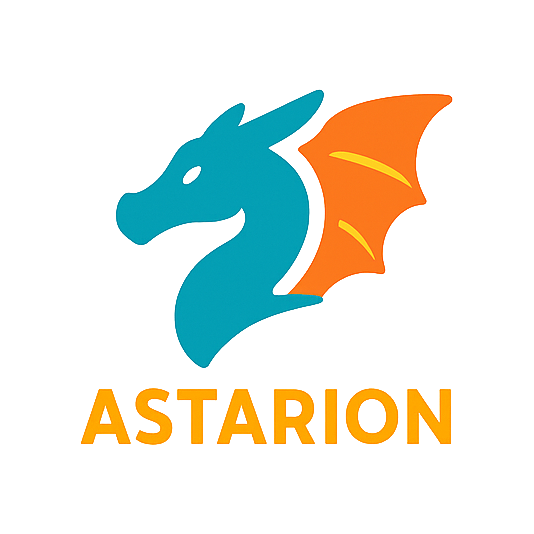
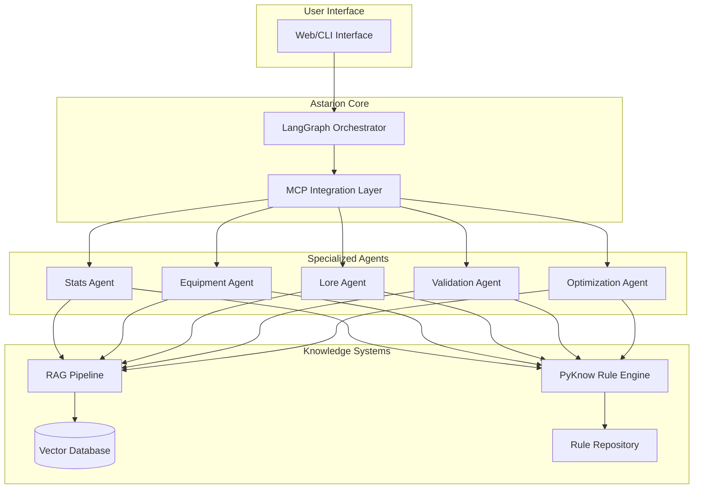

# Astarion 🧛‍♂️

<p align="center">
  
</p>

<p align="center">
  <strong>An intelligent LLM-powered assistant for RPG character creation and rule validation</strong>
</p>

<p align="center">
  <a href="#features">Features</a> •
  <a href="#architecture">Architecture</a> •
  <a href="#installation">Installation</a> •
  <a href="#usage">Usage</a> •
  <a href="#roadmap">Roadmap</a> •
  <a href="#contributing">Contributing</a>
</p>

<p align="center">
  
  
  
</p>

---

## Overview

Astarion is a sophisticated Python-based LLM agent designed to revolutionize tabletop RPG character creation through intelligent assistance, automated rule validation, and optimization suggestions. Built on cutting-edge technologies including **LangGraph** for agent orchestration, **Model Context Protocol (MCP)** for standardized data access, and advanced **RAG systems** for rulebook processing.

### Key Features

- 🎲 **Multi-System Support**: Initially supporting D&D 5e and Pathfinder, with extensible architecture for any RPG system
- 📚 **Intelligent PDF Processing**: Upload rulebooks and automatically extract rules, spells, items, and mechanics
- ✅ **Comprehensive Validation**: Every character decision validated against official rules with source citations
- 🚀 **MinMax Optimization**: Get build suggestions optimized for your playstyle and goals
- 🔍 **Source Attribution**: Every rule application includes precise rulebook references
- 🤖 **Multi-Agent Architecture**: Specialized agents for stats, equipment, lore, and validation
- 🔌 **Extensible Plugin System**: Add new game systems through simple PDF uploads

## Architecture



### Technology Stack

- **Agent Framework**: [LangGraph](https://github.com/langchain-ai/langgraph) - Production-grade orchestration
- **Protocol Layer**: [Model Context Protocol (MCP)](https://modelcontextprotocol.io/) - Standardized LLM-data integration
- **PDF Processing**: PyMuPDF + pdfplumber hybrid approach
- **Vector Database**: Qdrant with BGE-M3 embeddings
- **Rule Engine**: PyKnow for deterministic rule execution
- **Validation**: python-constraint + OR-Tools for constraint satisfaction
- **API Framework**: FastAPI with async support

## Installation

### Prerequisites

- Python 3.13 or higher
- Poetry 2
- Docker (optional, for containerized deployment)

### Quick Start

```bash
# Clone the repository
git clone https://github.com/kerbaras/astarion.git
cd astarion

poetry install
poetry run astarion
```

### Docker Installation

```bash
# Build and run with Docker Compose
docker-compose up -d
```

## Usage

### Basic Character Creation

```python
from astarion import AstarionClient

# Initialize client
client = AstarionClient()

# Create a D&D 5e character
character = await client.create_character(
    system="dnd5e",
    name="Elara Moonwhisper",
    race="Elf",
    subrace="High Elf",
    class_name="Wizard",
    level=1,
    optimization_goals=["spell_damage", "survivability"]
)

# View validation results with source citations
print(character.validation_report)
```

### Adding a New Rulebook

```python
# Upload a new rulebook PDF
rulebook = await client.add_rulebook(
    file_path="path/to/players_handbook.pdf",
    system="dnd5e",
    book_name="Player's Handbook",
    version="5th Edition"
)

# The system will automatically:
# 1. Extract and chunk content
# 2. Generate embeddings for RAG
# 3. Extract rules for PyKnow engine
# 4. Validate against existing rules
```

### MCP Server Example

```python
# Start an MCP server for D&D 5e rules
from astarion.mcp import create_dnd5e_server

server = create_dnd5e_server()

# The server provides tools like:
# - validate_multiclass_requirements
# - calculate_spell_slots
# - check_feat_prerequisites
# - get_class_features
```

## Project Structure

```
astarion/
├── agents/              # LangGraph agent implementations
│   ├── stats.py
│   ├── equipment.py
│   ├── lore.py
│   ├── validation.py
│   └── optimization.py
├── mcp/                 # Model Context Protocol servers
│   ├── dnd5e/
│   ├── pathfinder/
│   └── base.py
├── rag/                 # RAG pipeline components
│   ├── extractors/
│   ├── chunkers/
│   └── embedders/
├── rules/               # PyKnow rule definitions
│   ├── dnd5e/
│   ├── pathfinder/
│   └── engine.py
├── api/                 # FastAPI endpoints
├── web/                 # Frontend (if applicable)
```

## Development

### Running Tests

```bash
# Run all tests
pytest

# Run with coverage
pytest --cov=astarion

# Run specific test category
pytest tests/agents/
pytest tests/rules/
```

### Adding a New Game System

1. Create a new directory under `mcp/` for your system
2. Implement the MCP server with system-specific tools
3. Add rule templates under `rules/your_system/`
4. Create extraction patterns in `rag/extractors/`
5. Submit a pull request with tests

### Code Style

We use Black for code formatting and follow PEP 8 guidelines:

```bash
# Format code
black astarion/

# Check linting
flake8 astarion/

# Type checking
mypy astarion/
```

## Roadmap

### Phase 1: Core Implementation
- [ ] LangGraph orchestrator architecture
- [ ] Basic MCP server for D&D 5e
- [ ] PDF processing pipeline
- [ ] Initial validation engine
- [ ] CLI interface

### Phase 2: Advanced Features
- [ ] Complete RAG system with Qdrant
- [ ] PyKnow rule generation from PDFs
- [ ] MinMax optimization algorithms
- [ ] Pathfinder support
- [ ] Web interface

### Phase 3: Production Ready
- [ ] Plugin architecture
- [ ] Community rulebook marketplace
- [ ] VTT integrations (Roll20, FoundryVTT)
- [ ] Performance optimizations
- [ ] Cloud deployment options

### Phase 4: Extended Features
- [ ] AI-assisted homebrew rule creation
- [ ] Campaign management tools
- [ ] Multi-language support
- [ ] Mobile companion app

## Contributing

We welcome contributions! Please see our [Contributing Guidelines](CONTRIBUTING.md) for details.

### How to Contribute

1. Fork the repository
2. Create a feature branch (`git checkout -b feature/amazing-feature`)
3. Commit your changes (`git commit -m 'Add amazing feature'`)
4. Push to the branch (`git push origin feature/amazing-feature`)
5. Open a Pull Request

## License

This project is licensed under the MIT License - see the [LICENSE](LICENSE) file for details.

## Acknowledgments

- Named after the beloved vampire spawn from Baldur's Gate 3
- Built on the shoulders of giants: LangChain, LangGraph, and the open-source community
- Special thanks to the tabletop RPG community for inspiration and feedback

## Citation

If you use Astarion in your research or projects, please cite:

```bibtex
@software{astarion2025,
  title = {Astarion: An LLM-Powered Assistant for Tabletop RPG Character Creation},
  year = {2025},
  url = {https://github.com/kerbaras/astarion}
}
```

---

<p align="center">
  Made with ❤️ for the Role Community
</p>

<p align="center">
  <i>"I'm not a details person, darling. But when it comes to rules... well, let's just say I'm very particular."</i> - Astarion
</p>